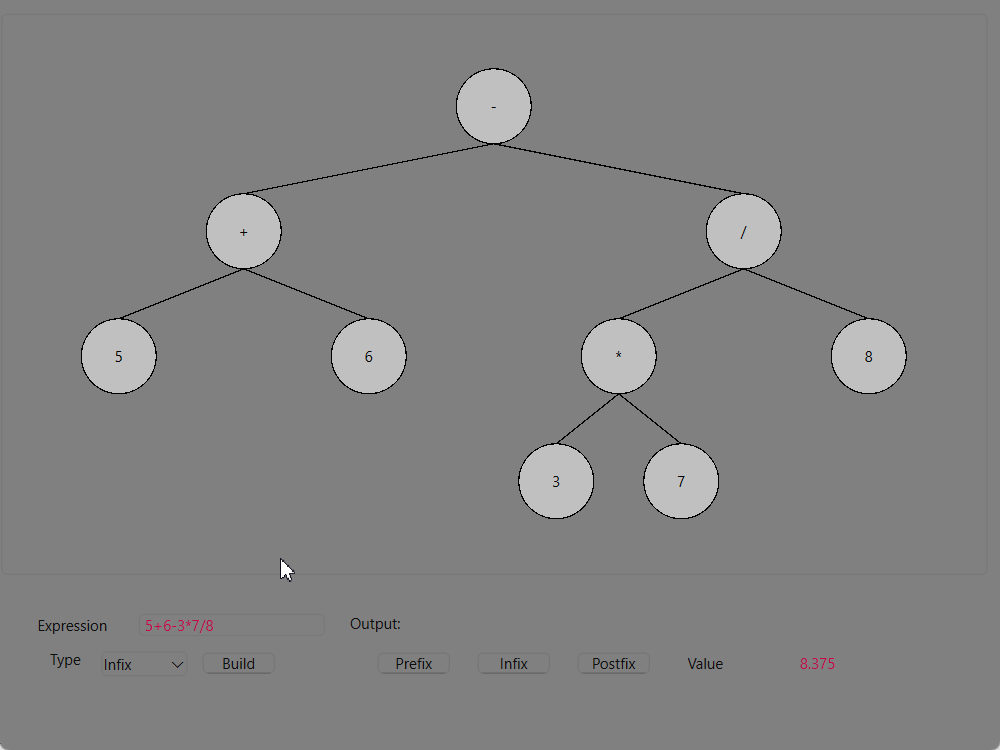

# 🔄 ADS: Postfix, Infix, and Prefix Conversions

**Project Type:** Data Structures (Expression Trees)
**Technologies Used:**

* 💻 C++
* 🎨 Qt (for GUI interface)

---

## 📘 Overview

This project implements efficient algorithms for converting between **Postfix**, **Infix**, and **Prefix** notations using an **Expression Tree**. The system supports bidirectional conversion between all three formats and evaluates expressions in **Postfix** and **Prefix** form.

Built for use in data structure visualization, compiler development education, and calculator-based applications.

---

## ✨ Features

* 🌲 **Expression Tree Construction**

  * Build trees from Postfix, Infix, or Prefix input.
  * Operators become internal nodes; operands are stored in leaf nodes.

* 🔁 **Bidirectional Conversions**

  * Postfix ↔ Infix
  * Postfix ↔ Prefix
  * Infix ↔ Prefix

* 🧮 **Expression Evaluation**

  * Evaluate Postfix and Prefix expressions directly.

* ✅ **Expression Validation**

  * Detects malformed expressions.
  * Flags errors like mismatched parentheses or invalid tokens.

---

## 🧠 How It Works

### 🧱 Expression Tree Structure

* Expressions are stored as **binary trees**.
* Tree nodes represent:

  * **Operators** (`+`, `-`, `*`, `/`, `^`) → Internal nodes.
  * **Operands** (e.g., `a`, `b`, `5`, `x`) → Leaf nodes.

### 🔄 Traversal-Based Conversion

| Traversal | Generates |
| --------- | --------- |
| Inorder   | Infix     |
| Preorder  | Prefix    |
| Postorder | Postfix   |

Traversal logic is used to generate equivalent representations once the tree is built.

### 🛡️ Input Validation

* Ensures:

  * Balanced parentheses
  * Valid symbols
  * Correct operator-operand sequence
* Helpful error messages guide user correction.

---

## 🖥️ GUI (Qt)

A clean and interactive GUI is provided using **Qt**, allowing:

* Input entry in any notation.
* Visualization of the Expression Tree.
* One-click conversion and evaluation.
* Real-time error reporting for invalid input.

---

## 🚀 How to Run

### 🧭 Open the Project in Qt

1. Open **Qt Creator**.
2. Select **File > Open File or Project**.
3. Navigate to the project directory and open the `.pro` file.
4. Configure the build environment if prompted.
5. Click the **Run** button to build and launch the application.

> 💡 **Note:** A downloadable `.exe` version that does not require Qt will be available soon.

---

## 📂 Example Inputs

| Input Notation | Expression    | Output Conversion    |
| -------------- | ------------- | -------------------- |
| Postfix        | `ab+c*`       | Infix: `(a + b) * c` |
| Prefix         | `*+abc`       | Postfix: `ab+c*`     |
| Infix          | `(a + b) * c` | Prefix: `* + a b c`  |

---

## 🖼️ Live Conversion Demo

---

## 📚 Educational Use

This project is ideal for:

* Visualizing how expression trees work.
* Understanding compiler parsing techniques.
* Demonstrating tree traversal algorithms in a classroom setting.

---

## 👥 Contributors

* Yousef Elmenshawy
* Ahmed Amgad
* Saif Sabry

---

## 📬 Contact & Contributions

If you have any questions or suggestions, feel free to reach out at **[yousefelmenshawi@aucegypt.edu](mailto:yousefelmenshawi@aucegypt.edu)**.

🎉 **Contributions are welcome!** If you'd like to improve or extend the project, feel free to open a pull request.
